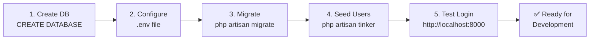

# ISRMS: Quick Start Guide

## Where We Are

✅ **Completed:**

- Frontend UI with all modules (Bootstrap 5 responsive)
- Authentication system (login, register, password reset)
- Database migrations (11 tables ready)
- Eloquent models (10 models with relationships)
- Routes & middleware

🔴 **Next:** Database table creation

---

## Immediate Next Steps

### 1️⃣ Create Database (if not exists)

```sql
CREATE DATABASE store_management;
```

Or via XAMPP:

- Open phpMyAdmin: http://localhost/phpmyadmin
- Click "New" on left sidebar
- Enter database name: `store_management`
- Click "Create"

---

### 2️⃣ Configure Laravel

Edit `.env`:

```env
DB_CONNECTION=mysql
DB_HOST=127.0.0.1
DB_PORT=3306
DB_DATABASE=store_management
DB_USERNAME=root
DB_PASSWORD=
```

---

### 3️⃣ Run Migrations

```bash
# Navigate to project
cd c:\xampp74\htdocs\store_management

# Create all tables
php artisan migrate
```

**Expected:** 12 migrations complete (1 users table + 10 new tables + 1 password resets)

---

### 4️⃣ Create Admin User (Manual or Seeder)

**Option A: Manual via Tinker**

```bash
php artisan tinker

>>> App\Models\User::create([
    'name' => 'Admin User',
    'email' => 'admin@store.com',
    'password' => 'Admin@123',
    'role' => 'admin',
    'is_active' => true,
])
```

**Option B: Create Seeder** (Recommended)

```bash
php artisan make:seeder UserSeeder
```

Then in `database/seeders/UserSeeder.php`:

```php
public function run()
{
    User::create([
        'name' => 'Admin',
        'email' => 'admin@store.com',
        'password' => bcrypt('Admin@123'),
        'role' => 'admin',
        'is_active' => true,
    ]);

    User::create([
        'name' => 'Storekeeper',
        'email' => 'store@store.com',
        'password' => bcrypt('Store@123'),
        'role' => 'storekeeper',
        'is_active' => true,
    ]);
}
```

Run seeder:

```bash
php artisan db:seed --class=UserSeeder
```

---

## Testing the System

### 1. Start Server

```bash
php artisan serve
```

### 2. Open Browser

```
http://127.0.0.1:8000
```

### 3. Access Login

- URL: `http://127.0.0.1:8000/auth/login`
- Email: `admin@store.com`
- Password: `Admin@123`

### 4. Check Dashboard

After login, you should see the dashboard with role-based menu.

---

## Database Tables Created

```
✅ users
✅ password_resets
✅ items
✅ sra
✅ sra_items
✅ requisitions
✅ requisition_items
✅ issues
✅ issue_items
✅ inventory_ledger
✅ notifications
✅ audit_logs
```

---

## Common Commands

```bash
# View all tables
php artisan tinker
>>> DB::select('SHOW TABLES;');

# Check table structure
>>> DB::select('DESCRIBE items;');

# Count records
>>> App\Models\Item::count();

# View all users
>>> App\Models\User::all();

# Exit tinker
exit()
```

---

## Troubleshooting

| Issue                      | Solution                                     |
| -------------------------- | -------------------------------------------- |
| "Base table not found"     | Run `php artisan migrate`                    |
| "Access denied for user"   | Ensure MySQL is running                      |
| "Column not found"         | Check migration files exist                  |
| "Port 8000 already in use" | Change port: `php artisan serve --port=8001` |

---

## Full SETUP WORKFLOW



---

## Next Phase After DB Setup

Once database is ready:

1. **Create API Controllers** (ItemController, SraController, etc.)
2. **Implement CRUD endpoints** (store, update, delete, show)
3. **Connect frontend forms** to backend endpoints
4. **Add validation** (form requests)
5. **Implement business logic** (approvals, stock updates)

---

## Files You Generated

**Documentation:**

- [DATABASE_SCHEMA.md](DATABASE_SCHEMA.md) - Complete database specification
- [SETUP_CHECKLIST.md](SETUP_CHECKLIST.md) - Full project checklist
- [AUTHENTICATION_GUIDE.md](AUTHENTICATION_GUIDE.md) - Auth system docs (if exists)

**Database:**

- 10 migration files in `database/migrations/`
- 10 model files in `app/Models/`
- Jobs and factories (optional)

**Routes:**

- All defined in `routes/web.php`
- Auth routes: `/auth/login`, `/auth/register`, etc.
- Protected routes: Dashboard, modules (behind auth middleware)

---

## Key Facts to Remember

| Aspect        | Value                                                 |
| ------------- | ----------------------------------------------------- |
| Database      | MySQL in XAMPP                                        |
| Database Name | `store_management`                                    |
| Tables        | 12 total                                              |
| Users Roles   | 5 (admin, storekeeper, auditor, principal, requester) |
| Main URL      | http://127.0.0.1:8000                                 |
| Login URL     | http://127.0.0.1:8000/auth/login                      |
| Default User  | admin@store.com / Admin@123                           |

---

## Support

**Documentation Files:**

1. DATABASE_SCHEMA.md - Database structure & queries
2. SETUP_CHECKLIST.md - Full project status
3. AUTHENTICATION_GUIDE.md - Auth implementation
4. This file - Quick start

**Next Questions?** Try:

- `php artisan help migrate` - Migration help
- `php artisan tinker` - Interactive shell
- Laravel Docs: https://laravel.com/docs

---

**Start Now:**

```bash
# Step 1: Ensure MySQL running
# Step 2: Update .env configuration
# Step 3: Run migrations
php artisan migrate

# Step 4: Test
php artisan serve
```

**You're ready! 🚀**
